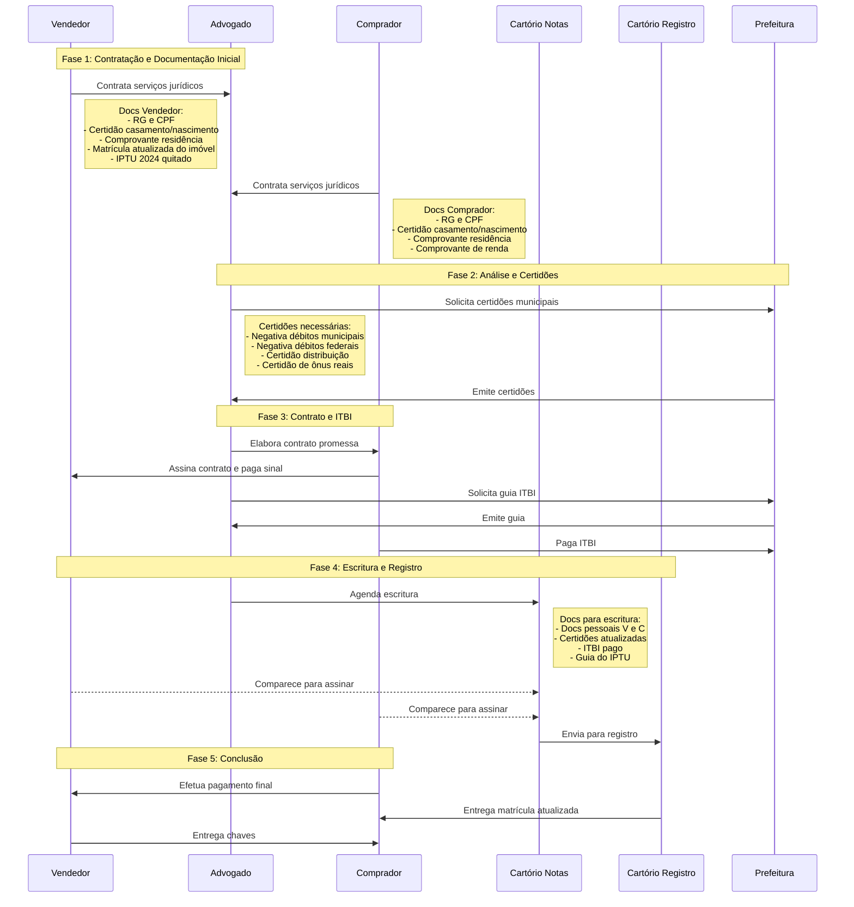

## Entidades Envolvidas:

- Comprador (Pessoa Física)
- Vendedor (Pessoa Física)
- Advogado
- Cartório de Registro de Imóveis [(ONR)](https://www.registrodeimoveis.org.br/intranet/arquivos/upload/geral/999999_upload_de_arquivos_geral_20230906_144922_7926cdd0-fda3-4122-8b8c-c408c7c708f1.pdf)
- Cartório de Notas
- Prefeitura Municipal (Recife)

## Diagrama de Sequência

